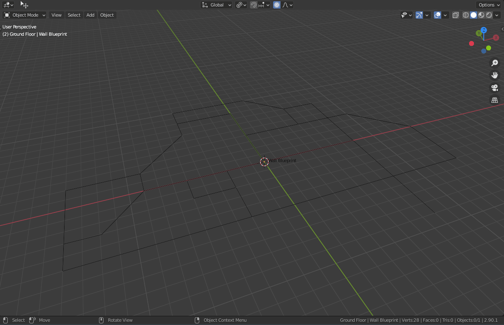

# Blender Add-on: WallBuilder
Utilities to improve wall and room building in Blender.

## Features:
### Create Walls (View3D > Object > WallBuilder > Create Walls) 
Introduces the functionality of generating a wall mesh object using a wireframe layout as reference.
First, create a 2D sketch out of edges and vertices for your wall layout.
Then, with your reference object active in object mode, execute the Create Walls operator.
The exposed settings allow you to configure the wall thickness, wall height and wether the wall mesh should be open or filled at the top and bottom.
The generated wall mesh will be UV-unwrapped and ready for texturing. 1 UV-Unit corresponds to 1 3D-Unit (for tileable textures).
Additionally, you can choose to assign a separate material for every face ring (wall).
The reference object will get hidden, not deleted. This makes it easy to make changes to the wall layout later on.

Special thanks to Alex (@ByteArrayInputStream) for helping me out with the math for this one.

## Changelog:
### v1.2 (21.12.2020)
* Added a default material for generated wall meshes
* Added an option to have a separate material per face ring
### v1.1 (20.12.2020)
* Added automatic UV generation for walls
* Added a default material for generated wall objects
* Made all verts per corner have the same elevation (Z-Axis) as the corresponding vertex in the reference object
### v1.0 (19.12.2020)
* Initial release

## Feel free to leave feedback and suggestions!
If this helped you out in any way, shape or form, feel free to let me know!
That's why I created this add-on in the end.
